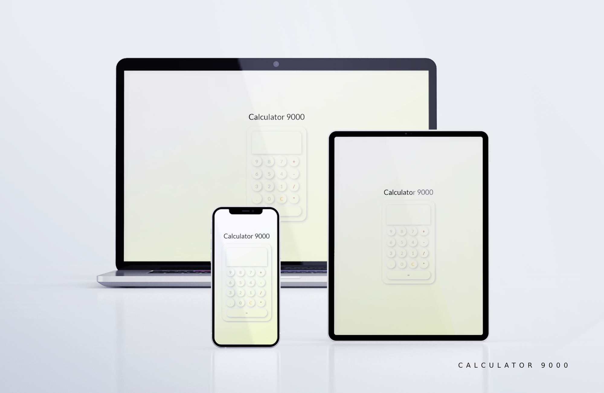

# calculator
React JS calculator

This app is developped in Reactjs and uses math.js library for the algebraic equations. 


## To download math.js

```shell
npm install mathjs
```

## This app is supposed to look like this:



if it doesn't, 

"fly you fools"

-- <cite>Gandalf the Grey, The FellowShip Of The Ring</cite>